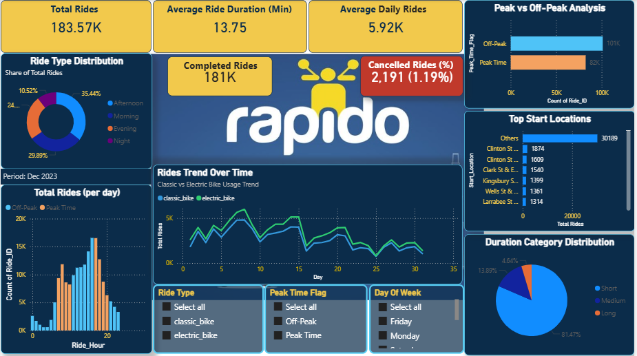
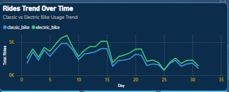
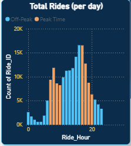
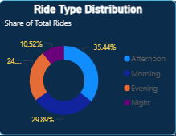
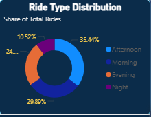
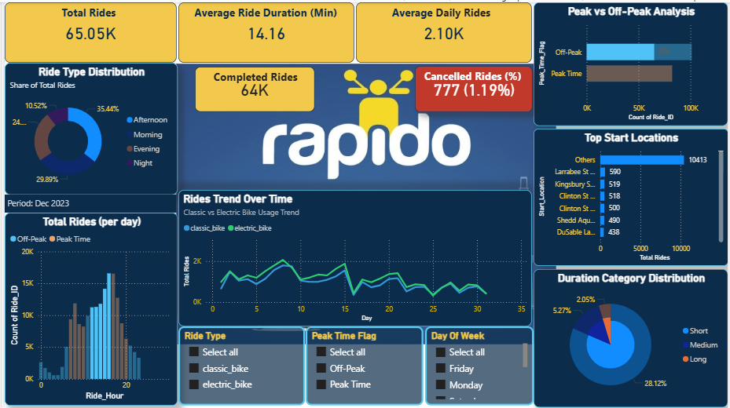
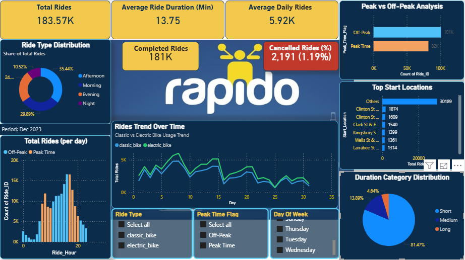

# 🚴 Rapido Ride Analytics | SQL + Power BI

## 📌 Project Overview
Analyzed 183K+ ride records to transform raw operational ride data into a structured analytical framework for performance and demand analysis.

## 🔎 Business Challenge
The dataset contained raw transactional ride data including timestamps, geo-coordinates, vehicle types, and customer attributes that was not structured for analytical reporting.

## 🔧 Data Engineering Approach
- Cleaned and standardized ride-level data
- Engineered peak/off-peak and time-based features
- Categorized ride durations
- Calculated geo-distance between start and end points
- Designed optimized fact-dimension data model
- Built reusable KPIs using DAX
- Validated metrics using SQL queries

## 📈 Key Insights Delivered
- Peak vs Off-Peak demand analysis
- Cancellation rate tracking (1.19%)
- Ride-type performance (Classic vs Electric)
- High-demand location identification
- Hourly and daily demand trends

## 💼 Business Impact
Enabled data-driven decisions for:
- Driver allocation
- Pricing optimization
- Operational planning

## 🛠 Tools Used
SQL | Power BI | DAX | Data Modeling
## 📷 Dashboard Preview

